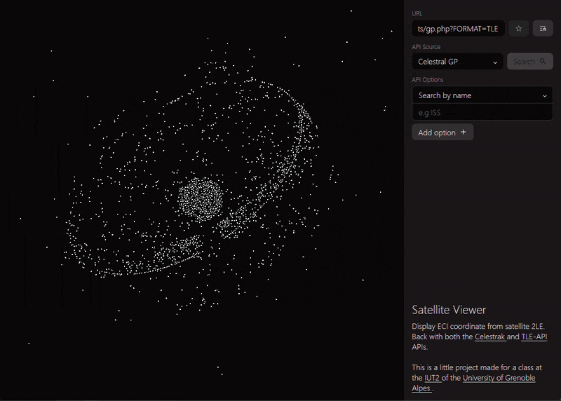
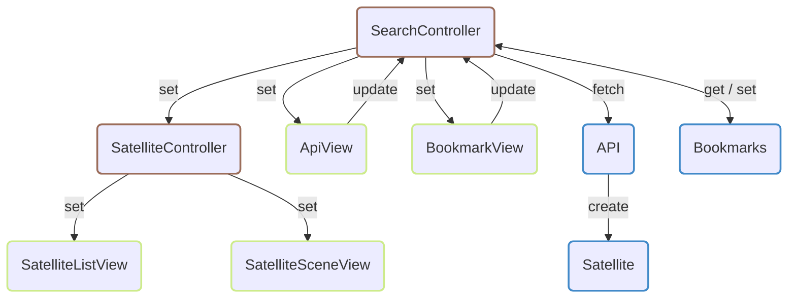

# Satellite Viewer



Little project that display ECI coordinates based on 2LE data from both the [Celestrak](https://celestrak.org) and [TLE-API](https://tle.ivanstanojevic.me) APIs.

This is a little project made for a class at the [IUT2](https://iut2.univ-grenoble-alpes.fr) of the [University of Grenoble Alpes](https://www.univ-grenoble-alpes.fr/).

## Repositery structure

This project was made in full vanilla JS and should be compatible with most modern-day browsers (at least as of 23/03/2025).

```
.
├── ...
├── celestrak-pipe.mjs                      # Script running on deploy
└── web
    ├── ...
    ├── cache-sw.mjs                        # Cache service worker
    ├── data
    │   └── satellites.bin                  # Default satellites orbitals elements
    └── scripts
        ├── index.mjs                       # Application entrypoint
        ├── cache.mjs                       # Cache worker entrypoint
        ├── utils.mjs                       # Utils used globally
        ├── bookmark.mjs                    # Modal for bookmarks
        ├── satellite.mjs                   # Modal for satellite
        ├── api
        │   ├── ...
        │   ├── api.mjs                     # Modal for API
        │   └── sources
        │       ├── celestrak.mjs           # API implementations for Celestrak
        │       └── tle-api.mjs             # API implementation for TLE-API
        ├── satellite
        │   ├── ...
        │   ├── satellite-controller.mjs    # Controller handling satellite interaction
        │   ├── satellite-list-view.mjs     # View listing satellite (for results)
        │   └── satellite-scene-view        # View displaying satellites in 3d
        │       ├── ...
        │       ├── scene-view.mjs          # View 3d scene renderer
        │       ├── scene-gestures.mjs      # Handler for view gestures (zoom, rotate, ...)
        │       ├── matrix.mjs              # Matrix implementations (for 3d, ...)
        │       ├── shader-program.mjs      # Shader assembler (compilation, ...)
        │       └── shaders                 # Shader programs' code
        │           └── ...
        └── search
            ├── ...
            ├── search-controller.mjs       # Controller handling search
            ├── api-view.mjs                # View handling api interaction
            ├── bookmark-view.mjs           # View handling bookmarks interaction
            └── fields.mjs                  # Utils to create custom input fields
```

### The MVC model

Here's a global representation of the implemented MVC model:



**Legend**

- Model in blue
- View in yellowgreen
- Controller in brow

### Note on `celestrak-pipe.mjs` & `web/data/satellites.bin`

The script `celestrak-pipe.mjs` is run every time the deploy workflow run on Github Action to get some TLEs from Celestrak and pre-transform them into binary in `data/satellites.bin`, that file being used to display the default satellites.

# TLE Data to ECI

The coordinates conversion from orbital elements (itself from TLE data) to Earth Centered Inertial (ECI) done here is an implementation (with some tweaks) of [the method described in this paper from M. René Schwarz](./docs/Keplerian_Orbit_Elements_to_Cartesian_State_Vectors.pdf), found on the internet.
