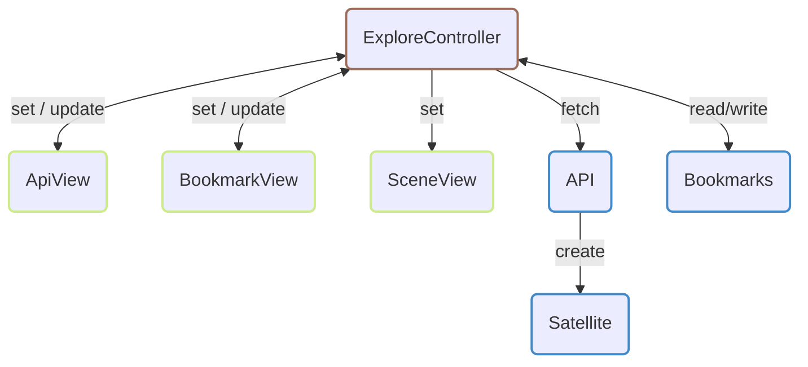

# Satellite Viewer


Little project that display ECI coordinates based on 2LE data from both the [Celestrak](https://celestrak.org) and [TLE-API](https://tle.ivanstanojevic.me) APIs.

This is a little project made for a class at the [IUT2](https://iut2.univ-grenoble-alpes.fr) of the [University of Grenoble Alpes](https://www.univ-grenoble-alpes.fr/).

## Repositery structure

This project was made in full vanilla JS and should be compatible with most modern-day browsers (at least as of 23/03/2025).

```
.
├── ...
├── celestrak-pipe.mjs                      # Script running on deploy
└── web
    ├── ...
    ├── cache-sw.mjs                        # Cache service worker
    ├── data
    │   └── satellites.bin                  # Default satellites orbitals elements
    └── scripts
        ├── index.mjs                       # Application entrypoint
        ├── cache.mjs                       # Cache worker entrypoint
        ├── bookmark.mjs                    # Bookmark modal
        ├── satellite.mjs                   # Satellite modal
        ├── api
        │   ├── ...
        │   ├── api.mjs                     # API Modal
        │   └── sources
        │       ├── celestrak.mjs           # Celestrak API implementations
        │       └── tle-api.mjs             # TLE-API API implementation
        ├── canvas
        │   ├── ...
        │   ├── scene-view.mjs              # View for scene renderer
        │   ├── scene-gestures.mjs          # Scene gestures (zoom, rotate, ...)
        │   ├── matrix.mjs                  # Matrix implementations (for projection & stuff)
        │   ├── shader-program.mjs          # Shader assembler (compile, uniforms access, ...)
        │   └── shaders                     # Shader programs' code
        │       └── ...
        └── explore
            ├── ...
            ├── explore-controller.mjs      # Controller handling the user exploration
            ├── api-view.mjs                # View handling api interaction
            ├── bookmark-view.mjs           # View handling bookmarks
            └── fields.mjs                  # Dynamic input fields implementation
```

### The MVC model

Here's a global representation of the implemented MVC model:


**Legend**
- Model in blue
- View in yellowgreen
- Controller in brow


### Note on `celestrak-pipe.mjs` & `web/data/satellites.bin`

The script `celestrak-pipe.mjs` is run on each deploy with Github Page to get and transform TLEs into binary in `data/satellites.bin`, that file being used to load and display default satellites.

# TLE Data to ECI

The orbital elements (from TLE data) to Earth Centered Inertial (ECI) coordinates conversion done here is an implementation with some tweaks of [the method described in this paper from M. René Schwarz](./docs/Keplerian_Orbit_Elements_to_Cartesian_State_Vectors.pdf), found on the internet.
